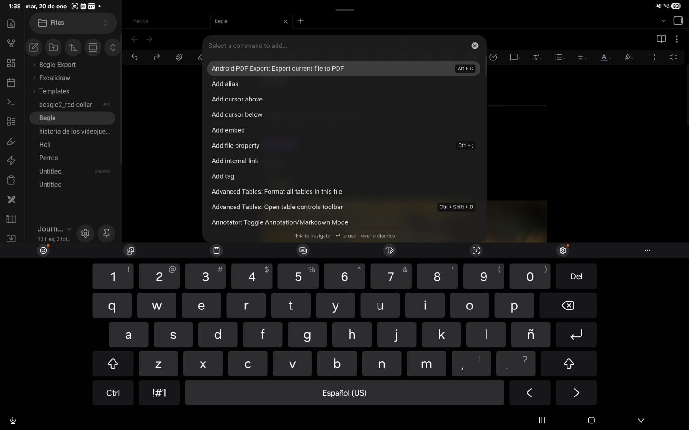
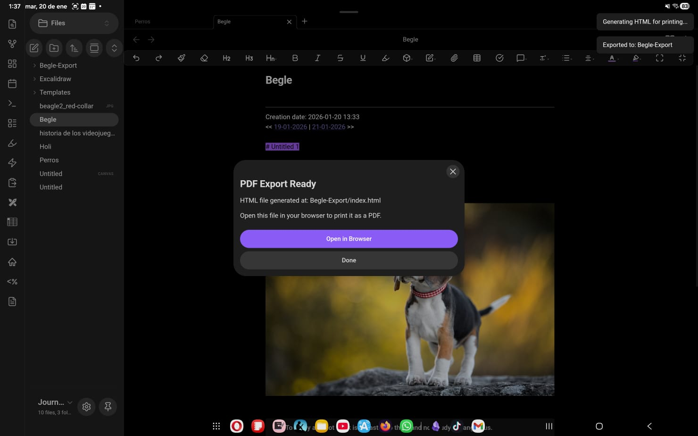
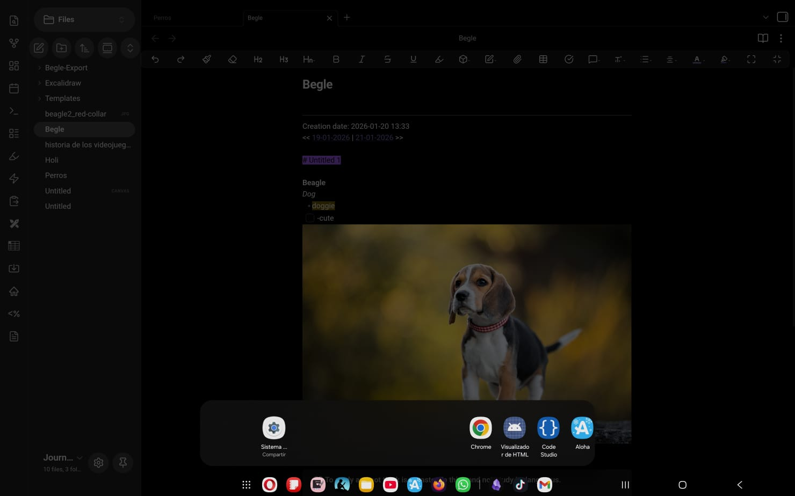
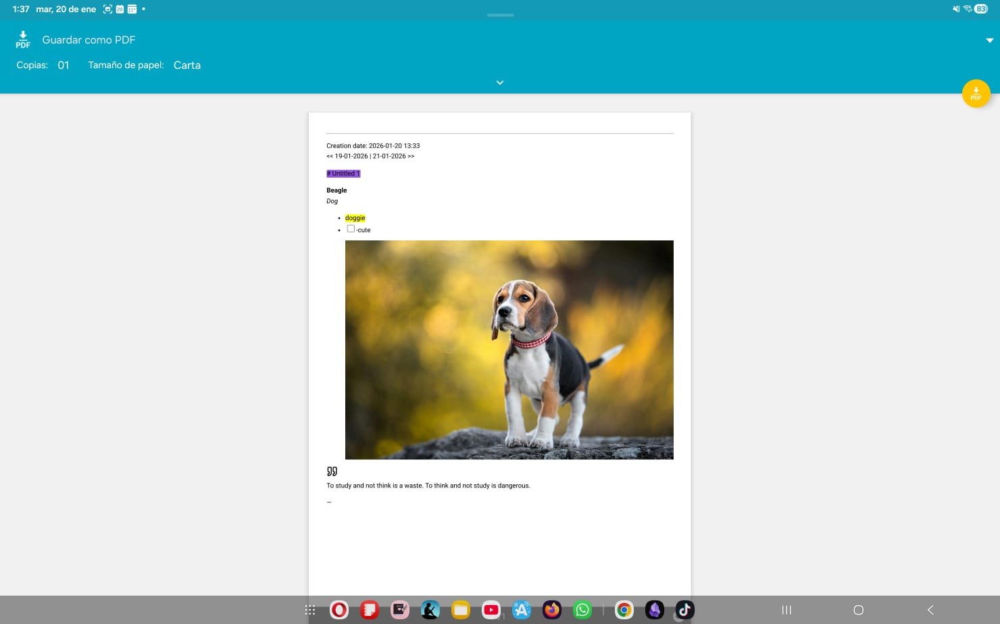
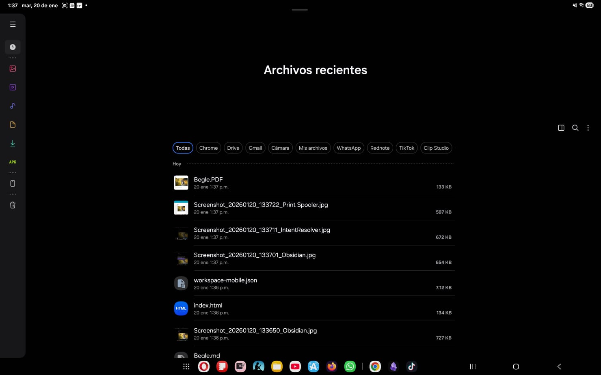

# Android PDF Export for Obsidian

This plugin is a workaround to enable exporting Obsidian notes to PDF on Android devices, a feature currently missing from the mobile version of Obsidian.

## How it Works (The Workaround)

Since Obsidian mobile does not possess a native PDF export engine, this plugin relies on the Android system's printing capabilities:

1.  **Render**: It uses Obsidian's internal Markdown renderer to convert your note into HTML.
2.  **Embed**: It finds all images (local and remote) and embeds them directly into the HTML file as Base64 data. This makes the HTML file "self-contained" (single-file), so it doesn't break when opened outside of Obsidian.
3.  **Save**: It saves this HTML file into your vault in a specific export folder.
4.  **Print**: It prompts you to open this file in your default browser (Chrome, WebView, etc.). The file includes a small script to automatically trigger the browser's "Print" dialog. From there, you can choose "Save as PDF".

## Features

- **Native Rendering**: Uses Obsidian's `MarkdownRenderer` so your plugins, callouts, and syntax highlighting should look mostly correct.
- **Offline Images**: Automatically converts local images (from your vault) into embedded Base64 data.
- **Remote Images**: Fetches and embeds images from the web (HTTP/HTTPS).
- **Clean Output**: Includes basic CSS optimization for printing (hides scrollbars, optimizes margins).
- **Sanitization**: Replaces unsupported media (Videos, Iframes) with placeholders to prevent print errors.

## Installation

1.  Open Obsidian Settings > Community Plugins.
2.  Turn off "Safe mode".
3.  Click "Browse" and search for "Android PDF Export" (once published).
4.  Install and Enable.

## How to Use

1.  Open the note you want to export.
2.  Click the **Ribbon Icon** (PDF Document icon) OR open the Command Palette and search for **"Export current file to PDF"**.
3.  Wait for the "Generating HTML..." notification.
4.  A modal will appear asking to **"Open in Browser"**. Click it.
5.  Your browser should open the file and automatically show the Print dialog.
6.  Select **"Save as PDF"** as the printer.

## Walkthrough (with Screenshots)

Below is a step-by-step walkthrough of using the plugin on Android, with screenshots of each interaction.

### 1) Open the note you want to export

This is the note you’ll export. The plugin uses Obsidian’s renderer, so what you see here is what gets turned into a printable HTML page.

### 2) Run the export command

Open the Command Palette and run **Android PDF Export: Export current file to PDF** (or use the ribbon icon if you’ve enabled it).

### 3) Obsidian confirms the export location

Once the HTML is generated and saved into your vault, Obsidian shows a confirmation modal with the output path. Tap **Open in Browser** to continue.

### 4) Pick a browser to open the generated HTML

After tapping **Open in Browser**, Android may ask what app to use to open the generated HTML. Choose your preferred browser (Chrome, WebView-based browser, etc.).

### 5) The browser opens the printable page and shows the print dialog

The plugin’s HTML is designed for printing. When opened, it triggers the browser’s print flow so you can save it as a PDF.

### 6) Your PDF is saved in Android’s Files app

After choosing **Save as PDF**, Android stores the PDF like any other downloaded/generated document. You can find it in the Files app (often under Recents or your selected destination).

## Development & Contributing

Contributions are welcome!

### Prerequisites

- Node.js
- Obsidian (for testing)

### Setup

1.  Fork and clone this repository.
2.  Run `npm install` to install dependencies.
3.  Run `npm run dev` to start the compiler in watch mode.
4.  Copy the `main.js`, `manifest.json`, and `styles.css` to your test vault's `.obsidian/plugins/obsidian-android-pdf/` folder.

### Testing

You can test this on the desktop version of Obsidian as well, though the styling options and printing behavior might vary slightly compared to Android's WebView.

### Contributing

- **Code**: Submit a Pull Request. Please attempt to follow existing code styles.
- **Issues**: Open an issue if you find bugs or have feature requests.

## License

MIT License. See [LICENSE](LICENSE) file.

## Credits

- Obsidian API (plugin runtime): https://obsidian.md
- Obsidian Sample Plugin (project structure inspiration): https://github.com/obsidianmd/obsidian-sample-plugin
- esbuild (bundler): https://github.com/evanw/esbuild
- TypeScript (language/compiler): https://www.typescriptlang.org
- tslib (TypeScript runtime helpers): https://github.com/microsoft/tslib
- builtin-modules (Node builtin module list used by the build): https://github.com/sindresorhus/builtin-modules
- esbuild-loader (build tooling dependency): https://github.com/privatenumber/esbuild-loader
- html2pdf.js (dependency): https://github.com/eKoopmans/html2pdf.js
